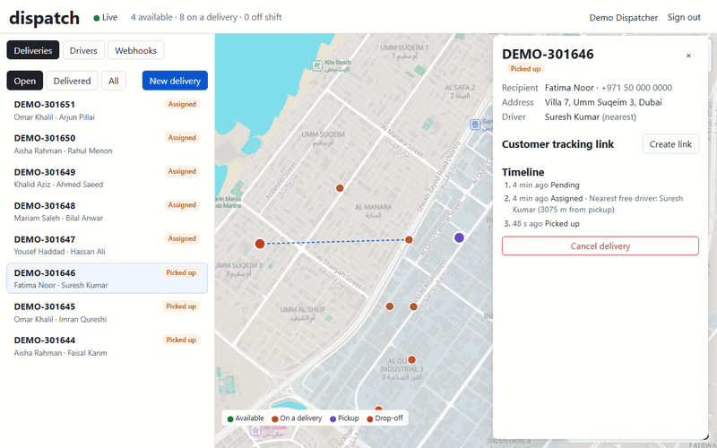
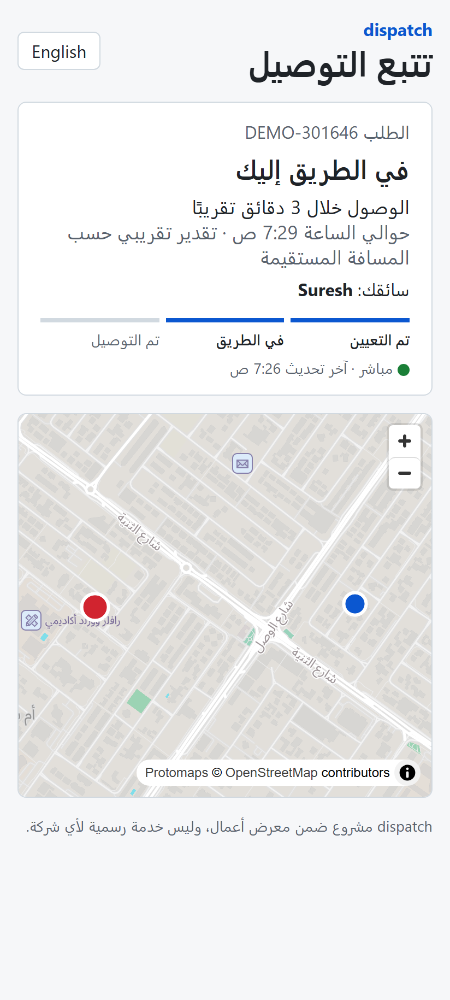
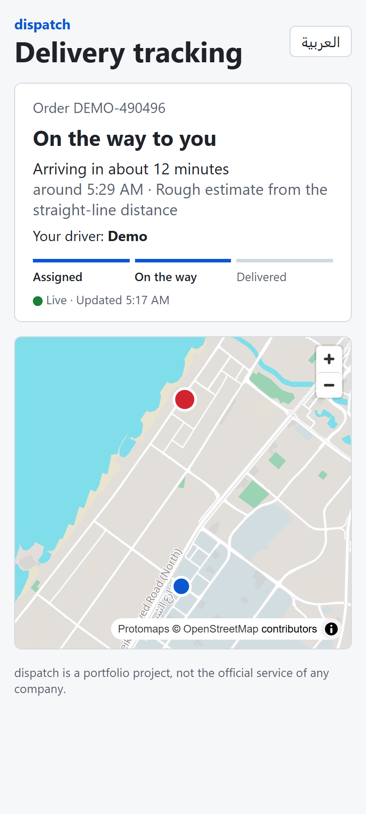
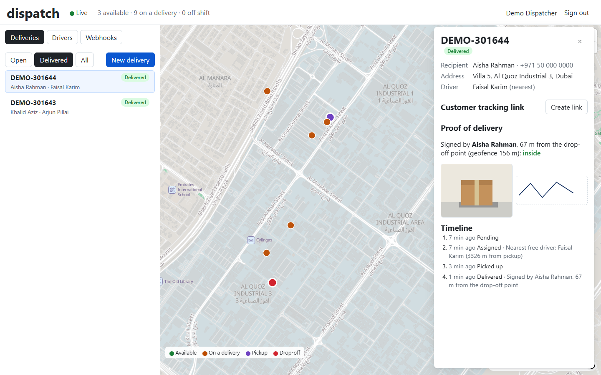
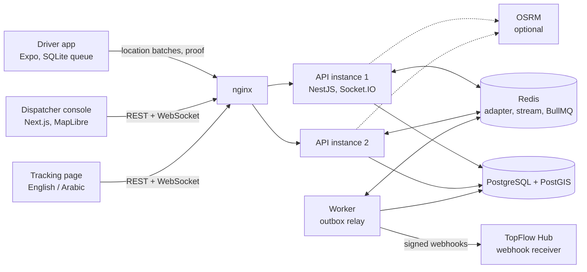

# dispatch

Live delivery tracking: dispatcher console, offline-first driver app, signed customer tracking links and proof of delivery.

[](https://github.com/fasharif/dispatch/actions/workflows/ci.yml)

A portfolio project. Each delivery carries an order number from
[TopFlow Hub](https://github.com/fasharif/topflow), another portfolio project, which the dispatcher
enters with the delivery; TopFlow Hub's webhook receiver then marks that order delivered (ADR-024
in its [`docs/DECISIONS.md`](https://github.com/fasharif/topflow/blob/develop/docs/DECISIONS.md)).
Nothing here serves a real company.

**Result so far:** in three 10-minute scale-test runs on one laptop, 1,000 simulated drivers sent
about 330 fixes a second to two API instances, and the instance serving one of two consoles was
killed halfway. None of the roughly 198,000 fixes stored in each run was lost on either console.
Driver-to-console latency was p50 9 ms and p95 46 to 53 ms. p99 was 145 to 407 ms, because each
run had one slow stretch of 1 to 2 minutes whose cause is not identified
([docs/scale-test.md](docs/scale-test.md)).



| Tracking page, Arabic                                                                                           | Tracking page, English                                        | Proof of delivery in the console                                                             |
| --------------------------------------------------------------------------------------------------------------- | ------------------------------------------------------------- | -------------------------------------------------------------------------------------------- |
|  |  |  |

## Problem

Once an order leaves the warehouse, the order system knows nothing until someone marks it
delivered. Dispatchers phone drivers to find out where they are, customers phone the shop to ask
when the parcel will arrive, and "delivered" is whatever the driver says. Drivers in Dubai lose
signal in car parks and tunnels, so anything that relies on a constant connection loses data.

## Features

- **Live map.** Every driver's position and every open delivery, updated over WebSockets as
  fixes arrive, on a Protomaps basemap of Dubai ([screenshot](docs/screenshots/console.png)).
  After a reconnect the console catches up on the positions it missed and reloads drivers and
  deliveries.
- **Nearest free driver.** New deliveries are assigned to the closest available driver with a
  recent fix (PostGIS KNN on a GiST index, safe under concurrent assignment, looking further out
  when the nearest drivers are taken). The dispatcher can see the candidates with distances and
  ETAs and override the choice before pickup.
- **Driver locations every few seconds**, from the driver app's background location task, sent
  in batches. The app asks expo-location for a position every 5 seconds whether or not the
  driver moves (Android honours the interval; iOS reports as positions arrive and the queue keeps
  at most one every 4 seconds), and while the app is open on shift it asks again after 30 seconds
  without one, so a driver waiting at the warehouse stays assignable. These are the configured
  values and expo-location's documented behaviour; the app has not run on a phone (see
  limitations).
- **Offline replay without duplicates.** Fixes wait in SQLite on the phone with a per-device
  sequence number and an idempotency key, and are replayed after any outage; the API stores each
  one once and says per fix whether it was accepted, a duplicate or a conflict. A replayed fix is
  broadcast again, so consoles never miss one that an instance stored just before it died.
- **Customer tracking links.** HMAC-signed and expiring (48 hours by default), no account needed.
  The page shows the driver's position and ETA while the parcel is on its way, in English or
  Arabic (right to left, Arabic map labels).
- **Proof of delivery.** Photo, signature and the phone's position, which must be within a
  geofence around the drop-off point (`ST_DWithin`, 150 m widened by the fix's accuracy). The
  phone's capture time must fall between the pickup and the server's time, give or take two
  minutes, because the order system records it as the delivery time.
- **Lost phones and drivers who leave.** Each phone gets its own device token at enrolment. From
  the Drivers tab a dispatcher can revoke a lost phone (its token is refused from the next
  request), issue a code for a replacement (enrolling it revokes the old phone) and deactivate a
  driver who has left. Invalid device tokens are limited per client address before any database
  lookup.
- **Webhooks to the order system** from a transactional outbox: HMAC-signed, retried with
  exponential backoff, idempotent by event id. TopFlow Hub's receiving side marks orders
  delivered through its own state machine. Both repositories test the same recorded, signed
  requests: TopFlow Hub's tests must accept them, and dispatch's end-to-end test fails when what
  the relay sends no longer has their shape (headers, signature format, field names and types).
  The copy in TopFlow Hub is updated by hand after a contract change
  ([apps/api/test/fixtures](apps/api/test/fixtures/README.md)).
- **ETA** from OSRM when it is configured (optional compose profile), otherwise a documented
  straight-line estimate; every ETA says which one it is.
- **Scale test.** Two API instances behind nginx, up to 1,000 simulated drivers in k6, a console
  on each instance, the instance of one console killed mid-run, and a count of lost events against
  the database for both consoles. It reports latency percentiles by phase and in 30-second
  windows, and each container's CPU and memory.

## Architecture



A fix travels like this: the phone records it into its SQLite queue and sends a batch; nginx
passes it to either API instance; the instance stores it (`ON CONFLICT DO NOTHING`), appends it
to a Redis stream and broadcasts it through the Socket.IO Redis adapter, so consoles connected
to the other instance receive it too; only then does the phone get its answer and remove the fix
from its queue. A console that reconnects asks for everything after the last stream id it saw,
and reloads drivers and deliveries over HTTP. If an instance dies between storing a fix and
broadcasting it, the phone gets no answer and sends the batch again; the other instance answers
"duplicate" and broadcasts the stored fix again. Delivery changes write an outbox row in the same
transaction; the worker turns outbox rows into BullMQ jobs that sign and send the webhooks.

## Stack and why

| Part                      | Choice                                                                           | Why                                                                                                                                                                                                                                                                     |
| ------------------------- | -------------------------------------------------------------------------------- | ----------------------------------------------------------------------------------------------------------------------------------------------------------------------------------------------------------------------------------------------------------------------- |
| API                       | NestJS 12 (ES modules), `pg` with SQL                                            | Modules, guards and gateways without hiding the SQL; the geo queries are PostGIS as written ([ADR-002](docs/decisions.md#adr-002--the-api-is-nestjs-running-as-native-es-modules), [ADR-003](docs/decisions.md#adr-003--postgresql-with-postgis-queried-in-sql-no-orm)) |
| Database                  | PostgreSQL 18 with PostGIS 3.6                                                   | KNN (`<->`) on GiST indexes, `ST_DWithin` on the ellipsoid, row locks for assignment                                                                                                                                                                                    |
| Realtime                  | Socket.IO 4, WebSocket transport only, `@socket.io/redis-adapter`, Redis stream  | Fan-out across instances without sticky sessions, and resume after a reconnect ([ADR-006](docs/decisions.md#adr-006--live-updates-socketio-over-websocket-only-redis-adapter-redis-stream-for-resume))                                                                  |
| Jobs                      | BullMQ on Redis 8                                                                | Retries with backoff and a job id per event for the outbox relay ([ADR-007](docs/decisions.md#adr-007--webhooks-through-a-transactional-outbox-relayed-by-bullmq))                                                                                                      |
| Console and tracking page | Next.js 16, React 19, MapLibre GL 6, Protomaps PMTiles                           | A street map from one static file, no tile server or API key; map fonts and symbols load from Protomaps' GitHub Pages site ([ADR-013](docs/decisions.md#adr-013--basemap-from-a-protomaps-pmtiles-extract-with-a-stated-fallback))                                      |
| Driver app                | Expo 57 (React Native 0.86), `expo-location`, `expo-task-manager`, `expo-sqlite` | Background location and a durable queue from one TypeScript codebase ([ADR-012](docs/decisions.md#adr-012--the-driver-apps-queue-lives-in-sqlite-behind-a-small-interface))                                                                                             |
| Contracts                 | zod 4 in `packages/shared`                                                       | One schema for validation and types across all apps ([ADR-001](docs/decisions.md#adr-001--one-repository-npm-workspaces-shared-zod-contracts))                                                                                                                          |
| Routing                   | OSRM (optional)                                                                  | Road-network ETAs when data is prepared; a stated fallback otherwise ([ADR-008](docs/decisions.md#adr-008--eta-from-osrm-when-configured-otherwise-a-stated-straight-line-estimate))                                                                                    |
| Load                      | k6 (grafana/k6 image), nginx                                                     | Many simulated drivers against two instances, with one killed mid-run ([ADR-014](docs/decisions.md#adr-014--the-scale-test-counts-lost-events-against-the-database))                                                                                                    |
| Tests                     | Vitest, Playwright, PostGIS and Redis containers                                 | Unit, integration and end-to-end tests against the real database features                                                                                                                                                                                               |

## Quick start

Needs Docker and Node.js 24.

```bash
git clone https://github.com/fasharif/dispatch.git && cd dispatch
scripts/fetch-basemap.sh      # Dubai street map, about 13 MB (runs go-pmtiles in Docker)
docker compose --profile stack up -d --build --wait
npm ci && npm run build -w @dispatch/shared -w @dispatch/simulator
npm run start -w @dispatch/simulator -- demo --api http://localhost:57080
```

Open <http://localhost:57080> and sign in as `dispatcher@dispatch.local` with the demo password
`dispatch-demo-2026` (local stacks only; production refuses to seed without
`SEED_DISPATCHER_PASSWORD`). The demo enrols 12 simulated drivers, creates an order every 40
seconds and drives each one through pickup and proof of delivery. Enrolment is rate limited, so
the first drivers can take a minute to appear. If the demo stops with an error (for example a
timeout while the stack is still warming up), run the last command again: it reuses the drivers
it created, and their simulated phones from the fleet file it writes
(`tools/simulator/fleet.json`, which holds device tokens and is ignored by git), and carries on
with their open deliveries. `docker compose --profile stack down -v` stops everything. The
stack's ports are bound to 127.0.0.1 only. Without the street map from step 2 the console still
works, but the map shows MapLibre's demo tiles: country outlines and no streets.

For development with hot reload: `docker compose up -d` (PostgreSQL and Redis only), copy
`apps/api/.env.example` to `apps/api/.env` and `apps/web/.env.example` to `apps/web/.env.local`,
then `npm run build -w @dispatch/shared`, `npm run db:migrate`, `npm run db:seed`,
`npm run dev -w @dispatch/api` and `npm run dev -w @dispatch/web` (console on
<http://localhost:57300>). The driver app starts with `npm start -w @dispatch/driver` in Expo;
it has not been run on a device (see limitations).

## Configuration

Every API variable is validated at start-up, and the process stops with a list of problems if
one is missing or malformed. The full list with defaults is in
[`apps/api/.env.example`](apps/api/.env.example); the ones you are most likely to change:

| Variable                                             | Default                                   | Purpose                                                            |
| ---------------------------------------------------- | ----------------------------------------- | ------------------------------------------------------------------ |
| `DATABASE_URL`, `REDIS_URL`                          | compose services on ports 57432 and 57379 | Data stores                                                        |
| `JWT_SECRET`, `TRACKING_TOKEN_SECRET`                | none (examples in `.env.example`)         | 32+ characters each; production refuses the examples (see below)   |
| `PROCESS_ROLE`                                       | `all`                                     | `api` (HTTP and WebSockets), `worker` (outbox relay) or both       |
| `PUBLIC_WEB_URL`, `CORS_ORIGINS`                     | `http://localhost:57300`                  | Base of tracking links; allowed browser origins                    |
| `TRACKING_LINK_TTL_HOURS`                            | 48                                        | Lifetime of a customer tracking link                               |
| `GEOFENCE_RADIUS_M`, `GEOFENCE_ACCURACY_ALLOWANCE_M` | 150, 50                                   | Proof-of-delivery fence around the drop-off point                  |
| `DRIVER_STALE_AFTER_S`                               | 120                                       | Drivers with older fixes are not assigned automatically            |
| `LOCATION_STREAM_RETENTION_MIN`                      | 15                                        | How long a reconnecting console can resume                         |
| `WEBHOOK_URL`, `WEBHOOK_SECRET`                      | empty                                     | Where signed events go; empty keeps them in the outbox             |
| `OSRM_URL`                                           | empty                                     | OSRM base URL for road ETAs; empty uses the straight-line estimate |
| `AUTH_THROTTLE_LIMIT`, `THROTTLE_LIMIT`              | 10, 600 per minute                        | Rate limits for sign-in and enrolment, and for everything else     |
| `AUTH_FAILURE_LIMIT`                                 | 30 per minute                             | Invalid device tokens per client address before it is refused      |
| `MAX_CLOCK_SKEW_S`                                   | 120                                       | How far a phone's clock may be off (fixes, proof capture time)     |

The compose stack runs with `NODE_ENV=production` but sets `ALLOW_INSECURE_LOCAL_SECRETS=true` by
default, so it starts with the example secrets on your own machine; the API then logs a warning
naming them. Set your own secrets and `ALLOW_INSECURE_LOCAL_SECRETS=false` before anyone else can
reach the stack.

The web app reads `NEXT_PUBLIC_API_URL` (empty means same origin, as behind nginx) and
`NEXT_PUBLIC_BASEMAP_URL` at build time ([`apps/web/.env.example`](apps/web/.env.example)), and
builds its Content-Security-Policy from them.

The compose stack's host ports are 57080 (nginx), 57432 (PostgreSQL) and 57379 (Redis). To run a
second stack on the same machine, give it another project name and ports, for example
`COMPOSE_PROJECT_NAME=dispatch-b DISPATCH_HTTP_PORT=57180 DISPATCH_POSTGRES_PORT=57532
DISPATCH_REDIS_PORT=57479 PUBLIC_WEB_URL=http://localhost:57180`; container, network, volume and
image names follow the project name.

Road ETAs: `scripts/prepare-osrm.sh` prepares the Geofabrik GCC extract (a 254 MB download for
the 25 September 2026 file; not processed on the development machine, see limitations) or, with
`--bbox 25.08,55.17,25.16,55.25`, a small box from the Overpass API; then
`docker compose --profile osrm up -d osrm` serves it on port 57500 (`http://osrm:5000` inside the
stack).

## Tests

| Command                                                                          | What it covers                                                                                                                                                                                                                                                                                                                                | Needs                                    |
| -------------------------------------------------------------------------------- | --------------------------------------------------------------------------------------------------------------------------------------------------------------------------------------------------------------------------------------------------------------------------------------------------------------------------------------------- | ---------------------------------------- |
| `npm test`                                                                       | Unit tests in every workspace: contracts, geo helpers, state machine, signatures, tokens, config, the webhook contract (recorded requests) and the capped reply read, the driver app's offline queue, replay and location policy, the console's state, live feed and Content-Security-Policy, i18n, demo seeding                              | Nothing                                  |
| `npm run test:integration`                                                       | API against PostGIS and Redis: location ingestion and replays, KNN assignment under concurrency and past locked drivers, ending a shift during an assignment, proof of delivery (geofence, ownership, capture time, concurrent retries), revoking phones and deactivating drivers, invalid-token limits, the outbox relay and webhook retries | `docker compose up -d`                   |
| `npm run test:e2e`                                                               | The core flow over HTTP and WebSockets: create, assign, track, pick up, deliver with proof, webhooks sent in the recorded contract's shape; sessions ending on time; two API instances: fan-out, a replayed fix broadcast again after its first broadcast was lost, and no lost fix when one instance goes away                               | `docker compose up -d`                   |
| `npm run test:browser -w @dispatch/web`                                          | Playwright: sign-in, live map, adding a driver and revoking its phone, deactivating a driver, creating a delivery on the map, deliveries changed while the console was disconnected, tracking page in English and Arabic; any Content-Security-Policy violation fails a test                                                                  | API and web app running, database seeded |
| `npm run bundle -w @dispatch/driver`                                             | Metro bundles the driver app for Android                                                                                                                                                                                                                                                                                                      | Nothing                                  |
| `npm run test:scale`                                                             | Scale test with a console on each instance ([docs/scale-test.md](docs/scale-test.md))                                                                                                                                                                                                                                                         | Docker                                   |
| `TEST_OSRM_URL=http://localhost:57500 npm run test:integration -w @dispatch/api` | ETAs against a real OSRM server                                                                                                                                                                                                                                                                                                               | The `osrm` compose profile               |

`npm run lint`, `npm run typecheck` and `npm run format:check` run the same checks as CI
([`.github/workflows/ci.yml`](.github/workflows/ci.yml)), which also runs the integration,
end-to-end and browser tests with PostGIS and Redis service containers, the driver bundle (after
checking the driver app's versions against the Expo SDK), a 20-driver scale smoke test,
shellcheck and actionlint on the scripts and the workflow, and a check that the workflow's PostGIS
and Redis service containers use the images in `docker-compose.yml`. Dependabot leaves React Native,
React and socket.io alone: the Expo SDK and NestJS decide those versions (ADR-019).

### Scale test at 1,000 drivers

```bash
K6_MEMORY=2g LISTENER_MEMORY=512m load/run-scale-test.sh --drivers 1000 --duration 600
```

There were three runs on 2 October 2026. Each used 1,000 drivers, one fix every 3 s, for
600 s, with the instance serving console A killed with SIGKILL after 300 s. They ran on a
Windows 11 Home laptop (AMD Ryzen 7 6800H, 16 GB) under Docker Desktop 4.93.0 (WSL 2). All
containers shared 16 CPUs and 7.4 GiB. Memory limits: k6 2 GiB, each console 512 MiB, each API
instance 384 MiB with 20 database connections, PostgreSQL 768 MiB, Redis 256 MiB.

| Run                                                       | Fixes stored | Lost (A / B) | Console B latency, p50 / p95 / p99 | p95 before the kill |
| --------------------------------------------------------- | ------------ | ------------ | ---------------------------------- | ------------------- |
| [20261002T194456Z](docs/scale-runs/20261002T194456Z.json) | 198,203      | 0 / 0        | 9 / 45 / 403 ms                    | 21 ms               |
| [20261002T195802Z](docs/scale-runs/20261002T195802Z.json) | 198,752      | 0 / 0        | 9 / 46 / 142 ms                    | 18 ms               |
| [20261002T201334Z](docs/scale-runs/20261002T201334Z.json) | 198,341      | 0 / 0        | 9 / 53 / 272 ms                    | 29 ms               |

Latency is measured from when the driver's batch was sent to when the console received the fix.
On average, all containers together used 2.1 to 2.4 of the 16 CPUs, and at most 1.2 GiB of
memory. After the kill, the surviving API instance carried the whole load at about two-thirds of
one CPU and at most 83 MiB. [docs/scale-test.md](docs/scale-test.md) has latency by phase, the
resource table, and what is and is not known about the slow stretches behind the p99 figures.

## Folder structure

```text
apps/
  api/             NestJS API and worker: REST, Socket.IO gateways, outbox relay, SQL migrations
  web/             Next.js dispatcher console and customer tracking page
  driver/          Expo driver app: background location, SQLite queue, proof of delivery
packages/
  shared/          zod contracts, delivery state machine, geo helpers, live-feed client
tools/
  simulator/       CLI: seed simulated drivers, drive them, run the demo, listen and verify
load/              k6 scale test, its runner and report
deploy/            nginx configuration for the compose stack
scripts/           Basemap extract, OSRM data preparation, the README's demo GIF
docs/              Decisions, scale test, screenshots
```

## Decisions

[docs/decisions.md](docs/decisions.md) records the architecture decisions: assignment under
concurrency, idempotent ingestion, resume after reconnect, the outbox, ETA assumptions, tracking
tokens, and the rest.

## Limitations and roadmap

- **The driver app has not run on a phone.** It type-checks, its lint passes, its offline queue,
  replay and location policy are unit-tested with Node's SQLite, and Metro bundles it. The
  location policy follows expo-location's documented behaviour; background location,
  permissions, update rates while standing still and battery use on real Android and iOS devices
  are untested.
- **The scale test has run on one laptop only.** Every container shared one Docker Desktop VM
  (16 CPUs, 7.4 GiB). In three 1,000-driver runs, p50 and p95 latency were steady, but p99
  varied from 145 to 407 ms, because each run had one slow stretch of 1 to 2 minutes. The CPU
  samples, PostgreSQL's log and Docker's events do not explain those stretches. In one run the
  killed API instance was started again almost four minutes after the kill, by something outside
  the harness that was not identified ([docs/scale-test.md](docs/scale-test.md)).
- **OSRM was checked with a small box of Dubai roads only.** The full GCC extract has not been
  processed on the development machine (shared with other workloads, limited memory), so its
  memory needs are not known here. The fallback ETA ignores traffic.
- The console reloads delivery and driver-status changes after a reconnect rather than replaying
  them, so it shows the current state, not every change made while it was away (ADR-017).
- `npm audit` reports 26 findings (7 moderate, 19 high) from three advisories, each counted once for
  the affected package and once for every package that depends on it: `uuid` below 11.1.1 (through
  `xcode` in Expo's config plugins), `braces` 3.0.3 (through `micromatch` in Metro and in the
  Next.js ESLint plugin) and `node-forge` 1.4.0 (the Expo CLI's code signing). `braces` and
  `node-forge` have no fixed release yet. All three are build and lint tooling; none of them runs in
  the API, the web app or the driver app's bundle (ADR-018).
- Automatic assignment ranks drivers by straight-line distance, not by road travel time.
- Proof-of-delivery photos are stored on a local volume; several API hosts would need shared or
  object storage.
- A tracking link cannot be revoked before it expires, except by rotating the secret.
- Revoking a phone does not take away a delivery the driver already carries; the dispatcher
  reassigns or cancels it. A driver with a delivery in hand cannot be deactivated until then.
- The map tiles are served locally, but the map's fonts and symbols load from
  `protomaps.github.io` at runtime, so browsers contact GitHub Pages (ADR-013).
- One seeded dispatcher account; no user management, roles or audit views.
- GPS spoofing is not detected.
- Roadmap: road-time assignment, importing orders from TopFlow Hub instead of typing their
  numbers, SMS or WhatsApp delivery of tracking links, object storage for photos, store builds of
  the driver app, a scale test with the services on separate machines.

## Licence

[MIT](LICENSE). Map data © [OpenStreetMap](https://www.openstreetmap.org/copyright) contributors,
available under the Open Database Licence; basemap by
[Protomaps](https://github.com/protomaps/basemaps). Map labels use Noto Sans glyphs from the
Protomaps assets, under the SIL Open Font Licence 1.1.
