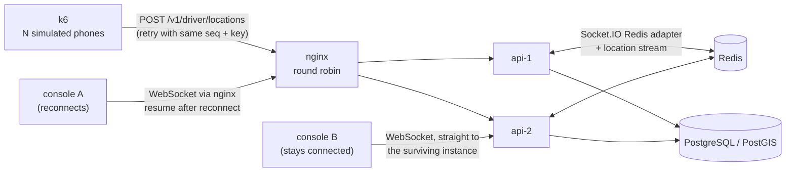

# Scale test

The question: with two API instances behind a load balancer, does every driver position reach a
dispatcher console, and how late, even when one instance dies mid-run? It is asked for two
consoles: one on the instance that dies, which must reconnect and catch up, and one on the
instance that survives, which never reconnects and so depends on every broadcast arriving.

## What runs



1. `docker compose --profile stack` starts PostgreSQL/PostGIS, Redis, two API instances, the
   worker and nginx.
2. `dispatch-sim seed` enrols N drivers through the API, as a dispatcher would.
3. Console A (`dispatch-sim listen`) connects through nginx like the web console: WebSocket only,
   reconnecting with backoff, resuming from the newest stream id it saw (with a 5-second overlap)
   and dropping repeats. It uses the same `LiveFeed` code as the console. The server tells each
   connection which instance serves it, and that instance is the one killed later.
4. Console B connects straight to the other instance and stays there. Fixes that arrive at the
   instance that dies reach it only through the Redis adapter or through the devices' replays.
5. k6 (`load/drivers.ts`, `grafana/k6:2.3.0`) runs one virtual user per driver. Each records a fix
   every few seconds and sends its queue; failed requests are resent with the same sequence
   numbers and idempotency keys, as the driver app does.
6. Halfway through, `docker compose kill --signal KILL` stops console A's instance. Console A loses its
   connection; requests in flight on that instance fail and are resent (nginx forwards failed
   location batches to the other instance, and k6 retries).
7. `dispatch-sim verify` compares the database, where every acknowledged fix is stored, with the
   fixes each console received. **A fix that is stored but was never received is a lost event.**

The run fails if any event is lost, if no fix was stored, if the kill did not make console A
reconnect and resume, or if console B lost its connection: in the last two cases the run did not
test what it claims to test. It also fails if the API refused a fix or never acknowledged one by
the end of the run, as k6 counts them: a lost event is measured against what the database stored,
so such fixes would otherwise not count. When no batch happened to be in flight on the dying instance (k6
counts no duplicates or retries), the run says so; the end-to-end test `two-instances.test.ts`
covers that path deterministically.

Latency is measured from the `sentAt` timestamp k6 puts on each batch to the moment a console
receives the fix. All containers run on the same Docker host, so they share a clock.

## Run it

```bash
load/run-scale-test.sh --drivers 50 --duration 120      # functional run, about 4 minutes
load/run-scale-test.sh --drivers 1000 --duration 600    # the full run, on a quiet machine
node load/report.mjs load/results/<run> --docs [--publish-timings]
```

The script builds the images, runs the test, prints a summary, exits non-zero on any of the
failures above, and stops the stack (keep it with `--keep-stack`). Container, network and image
names follow the compose project, so a second copy can run beside a stack that is already up:
set `COMPOSE_PROJECT_NAME` and move the host ports with `DISPATCH_HTTP_PORT`,
`DISPATCH_POSTGRES_PORT` and `DISPATCH_REDIS_PORT`. Memory limits can be raised with `API_MEMORY`,
`POSTGRES_MEMORY`, `K6_MEMORY` (512 MB by default) and `LISTENER_MEMORY` (256 MB). Runs of up to
50 drivers have used the defaults; the sizing for 1,000 drivers is untested. Raw results stay in
`load/results/<run>/` (not committed: the fleet file holds device tokens); `--docs` adds the run's
row below and writes the counts behind it, without tokens, ids or timings, to
[`docs/scale-runs/<run>.json`](scale-runs/). CI runs the 20-driver version and keeps the results
folder, without the fleet file, when the job fails.

## Results

Every row below comes from `load/run-scale-test.sh` followed by `node load/report.mjs --docs`. Runs
on a development machine shared with other workloads are functional checks only: they count lost
events, and their latencies are not published because other containers on the same machine
distort them. The latency columns are filled by a run on a quiet machine with
`--publish-timings`. "Replayed batches" counts k6's duplicate answers and retries: batches that
were resent because the instance died while handling them. "Refused / unacknowledged" counts
fixes the API answered with a conflict or a rejection, and fixes still unanswered when k6
stopped; both must be 0. Each run links to its counts. Run 20260926T033535Z was made in a fresh
clone that was deleted afterwards, before the counts files existed, so only its row remains.

<!-- results:start -->

| Run                                                  | Drivers | Duration | Fix interval | Instance killed          | Fixes stored | Received by console A | Received by console B | Lost (A / B) | Resumes (A) | Replayed batches | Refused / unacknowledged (k6) | p95 latency, all fixes (A)  | p95 latency, live fixes (B) | Environment                                                            |
| ---------------------------------------------------- | ------- | -------- | ------------ | ------------------------ | ------------ | --------------------- | --------------------- | ------------ | ----------- | ---------------- | ----------------------------- | --------------------------- | --------------------------- | ---------------------------------------------------------------------- |
| [20260926T024932Z](scale-runs/20260926T024932Z.json) | 50      | 120 s    | 3 s          | api-2 (SIGKILL, mid-run) | 1999         | 1999                  | 1999                  | 0 / 0        | 1           | 0                | 0 / 0                         | pending (quiet-machine run) | pending (quiet-machine run) | MINGW64_NT-10.0-26200, Docker 29.8.0, 16 CPUs, 7.4 GiB; commit e647905 |
| 20260926T033535Z                                     | 20      | 60 s     | 3 s          | api-2 (SIGKILL, mid-run) | 389          | 389                   | 389                   | 0 / 0        | 1           | 0                | not kept                      | pending (quiet-machine run) | pending (quiet-machine run) | MINGW64_NT-10.0-26200, Docker 29.8.0, 16 CPUs, 7.4 GiB; commit 5bd6e1d |
| [20260927T201726Z](scale-runs/20260927T201726Z.json) | 20      | 60 s     | 3 s          | api-2 (SIGKILL, mid-run) | 389          | 389                   | 389                   | 0 / 0        | 1           | 0                | 0 / 0                         | pending (quiet-machine run) | pending (quiet-machine run) | MINGW64_NT-10.0-26200, Docker 29.8.0, 16 CPUs, 7.4 GiB; commit f6b962a |

<!-- results:end -->

### Earlier runs, with one console

These two runs used the first version of the harness: a single console connected through nginx,
and `api-1` killed whatever instance the console was on. Both rows show one resume, so the console
was on the killed instance both times. Neither run had a console on the surviving instance, which
is the case the second console now covers (see ADR-006).

| Run              | Drivers | Duration | Fix interval | Instance killed          | Fixes stored | Fixes received | Lost | Resumes | p95 latency, all fixes      | p95 latency, live fixes     | Environment                                                            |
| ---------------- | ------- | -------- | ------------ | ------------------------ | ------------ | -------------- | ---- | ------- | --------------------------- | --------------------------- | ---------------------------------------------------------------------- |
| 20260925T234728Z | 50      | 120 s    | 3 s          | api-1 (SIGKILL, mid-run) | 1861         | 1861           | 0    | 1       | pending (quiet-machine run) | pending (quiet-machine run) | MINGW64_NT-10.0-26200, Docker 29.8.0, 16 CPUs, 7.4 GiB; commit 475f9ae |
| 20260926T013333Z | 20      | 60 s     | 3 s          | api-1 (SIGKILL, mid-run) | 379          | 379            | 0    | 1       | pending (quiet-machine run) | pending (quiet-machine run) | MINGW64_NT-10.0-26200, Docker 29.8.0, 16 CPUs, 7.4 GiB; commit 2a1408b |

## Reading the numbers

- **Lost** must be 0 for both consoles. A fix is stored before it is acknowledged, and appended to
  the Redis stream and broadcast before the response. Console A asks for everything after the
  newest stream id it saw when it reconnects. Console B relies on the broadcast; if the instance
  died after storing a fix but before its broadcast left, the device gets no answer and replays
  the batch, and the surviving instance broadcasts the stored fix again under its original stream
  id (ADR-005).
- **p95, all fixes** includes fixes recovered by a resume, whose delay includes the reconnect.
  **p95, live fixes** covers fixes that arrived over an open connection.
- The stream keeps 15 minutes (`LOCATION_STREAM_RETENTION_MIN`). A console away for longer
  receives `gap: true`; it reloads drivers and deliveries on every connection anyway.
