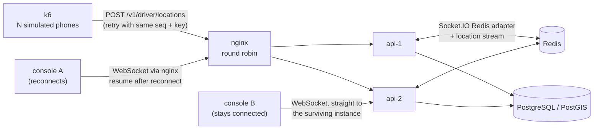

# Scale test

The question: with two API instances behind a load balancer, does every driver position reach a
dispatcher console, and how late, even when one instance dies mid-run? It is asked for two
consoles: one on the instance that dies, which must reconnect and catch up, and one on the
instance that survives, which never reconnects and so depends on every broadcast arriving.

## What runs



1. `docker compose --profile stack` starts PostgreSQL/PostGIS, Redis, two API instances, the
   worker and nginx.
2. `dispatch-sim seed` enrols N drivers through the API, as a dispatcher would.
3. Console A (`dispatch-sim listen`) connects through nginx like the web console: WebSocket only,
   reconnecting with backoff, resuming from the newest stream id it saw (with a 5-second overlap)
   and dropping repeats. It uses the same `LiveFeed` code as the console. The server tells each
   connection which instance serves it, and that instance is the one killed later.
4. Console B connects straight to the other instance and stays there. Fixes that arrive at the
   instance that dies reach it only through the Redis adapter or through the devices' replays.
5. k6 (`load/drivers.ts`, `grafana/k6:2.3.0`) runs one virtual user per driver. Each starts at a
   random point within its first interval, as phones are not in step, then records a fix every few
   seconds and sends its queue; failed requests are resent with the same sequence numbers and
   idempotency keys, as the driver app does.
6. Halfway through, counted from the first stored fix, `docker compose kill --signal KILL` stops
   console A's instance. Console A loses its connection; requests in flight on that instance fail
   and are resent (nginx forwards failed location batches to the other instance, and k6 retries).
7. When k6 has finished, both consoles are stopped and `dispatch-sim verify` compares the
   database, where every acknowledged fix is stored, with the fixes each console received. **A fix
   that is stored but was never received is a lost event.**

The run fails if any event is lost, if no fix was stored, if the kill did not make console A
reconnect and resume, or if console B lost its connection: in the last two cases the run did not
test what it claims to test. It also fails if the API refused a fix or never acknowledged one by
the end of the run, as k6 counts them: a lost event is measured against what the database stored,
so such fixes would otherwise not count. When no batch happened to be in flight on the dying instance (k6
counts no duplicates or retries), the run says so; the end-to-end test `two-instances.test.ts`
covers that path deterministically.

Latency is measured from the `sentAt` timestamp k6 puts on each batch to the moment a console
receives the fix, and again from the fix's `recordedAt`, which also counts any time the batch spent
being retried. All containers run on the same Docker host, so they share a clock. The consoles
keep every value, so the report gives p50, p95, p99 and the maximum for the whole run, for each
phase (before the kill, the 30 s after it, the rest) and for each 30-second window. The runner also
samples `docker stats` for every container every 5 s, and keeps PostgreSQL's log (checkpoints and
autovacuum runs), nginx's log (failed upstream connections) and Docker's start, stop and kill
events for the stack, so a slow period can be checked against them.

## Run it

```bash
load/run-scale-test.sh --drivers 50 --duration 120      # functional run, about 4 minutes
# The full run, about 13 minutes, with no other container running:
K6_MEMORY=2g LISTENER_MEMORY=512m load/run-scale-test.sh --drivers 1000 --duration 600
node load/report.mjs load/results/<run> --docs [--publish-timings]
```

The script builds the images, runs the test, prints a summary, exits non-zero on any of the
failures above, and stops the stack (keep it with `--keep-stack`). Container, network and image
names follow the compose project, so a second copy can run beside a stack that is already up:
set `COMPOSE_PROJECT_NAME` and move the host ports with `DISPATCH_HTTP_PORT`,
`DISPATCH_POSTGRES_PORT` and `DISPATCH_REDIS_PORT`. Memory limits can be raised with `API_MEMORY`,
`POSTGRES_MEMORY`, `K6_MEMORY` (512 MB by default) and `LISTENER_MEMORY` (256 MB), and the API
instances' database connections with `DATABASE_POOL_MAX` (20 each by default in the stack). Runs
of up to 50 drivers use the defaults; at 1,000 drivers k6 peaked at 441 MiB and each console at
97 MiB, hence the two raised limits above. Raw results stay in `load/results/<run>/` (not
committed: the fleet file holds device tokens); `--docs` adds the run's row below and writes the
counts behind it, without tokens or ids, to [`docs/scale-runs/<run>.json`](scale-runs/), with the
latency percentiles and resource use when `--publish-timings` is given. CI runs the 20-driver
version and keeps the results folder, without the fleet file, when the job fails.

## Results

Every row below comes from `load/run-scale-test.sh` followed by `node load/report.mjs --docs`. The
runs up to 27 September were made while other workloads shared the machine: they are functional
checks, and their latencies are not published because those workloads distort them. The runs of
2 October were made with no other container running and recorded with `--publish-timings`;
their latency columns give p50 / p95 / p99 in milliseconds, and the next section describes them.
"Replayed batches" counts k6's duplicate answers and retries: batches that were resent because the
instance died while handling them. "Refused / unacknowledged" counts fixes the API answered with a
conflict or a rejection, and fixes still unanswered when k6 stopped; both must be 0. Each run links
to its counts (and, for 2 October, its latency by phase and by 30-second window, and its resource
use). Run 20260926T033535Z was made in a fresh clone that was deleted afterwards, before the counts
files existed, so only its row remains.

<!-- results:start -->

| Run                                                  | Drivers | Duration | Fix interval | Instance killed          | Fixes stored | Received by console A | Received by console B | Lost (A / B) | Resumes (A) | Replayed batches | Refused / unacknowledged (k6) | Latency p50 / p95 / p99, all fixes (A) | Latency p50 / p95 / p99, live fixes (B) | Environment                                                                                       |
| ---------------------------------------------------- | ------- | -------- | ------------ | ------------------------ | ------------ | --------------------- | --------------------- | ------------ | ----------- | ---------------- | ----------------------------- | -------------------------------------- | --------------------------------------- | ------------------------------------------------------------------------------------------------- |
| [20260926T024932Z](scale-runs/20260926T024932Z.json) | 50      | 120 s    | 3 s          | api-2 (SIGKILL, mid-run) | 1999         | 1999                  | 1999                  | 0 / 0        | 1           | 0                | 0 / 0                         | not published (shared machine)         | not published (shared machine)          | MINGW64_NT-10.0-26200, Docker 29.8.0, 16 CPUs, 7.4 GiB; commit e647905                            |
| 20260926T033535Z                                     | 20      | 60 s     | 3 s          | api-2 (SIGKILL, mid-run) | 389          | 389                   | 389                   | 0 / 0        | 1           | 0                | not kept                      | not published (shared machine)         | not published (shared machine)          | MINGW64_NT-10.0-26200, Docker 29.8.0, 16 CPUs, 7.4 GiB; commit 5bd6e1d                            |
| [20260927T201726Z](scale-runs/20260927T201726Z.json) | 20      | 60 s     | 3 s          | api-2 (SIGKILL, mid-run) | 389          | 389                   | 389                   | 0 / 0        | 1           | 0                | 0 / 0                         | not published (shared machine)         | not published (shared machine)          | MINGW64_NT-10.0-26200, Docker 29.8.0, 16 CPUs, 7.4 GiB; commit f6b962a                            |
| [20261002T194456Z](scale-runs/20261002T194456Z.json) | 1000    | 600 s    | 3 s          | api-2 (SIGKILL, mid-run) | 198203       | 198203                | 198203                | 0 / 0        | 1           | 0                | 0 / 0                         | 9 / 46 / 407 ms                        | 9 / 45 / 403 ms                         | MINGW64_NT-10.0-26200, Docker 29.8.1, 16 CPUs, 7.4 GiB; 20 DB connections per API; commit f0c42ec |
| [20261002T195802Z](scale-runs/20261002T195802Z.json) | 1000    | 600 s    | 3 s          | api-2 (SIGKILL, mid-run) | 198752       | 198752                | 198752                | 0 / 0        | 1           | 3                | 0 / 0                         | 9 / 47 / 145 ms                        | 9 / 46 / 142 ms                         | MINGW64_NT-10.0-26200, Docker 29.8.1, 16 CPUs, 7.4 GiB; 20 DB connections per API; commit 7ca8fae |
| [20261002T201334Z](scale-runs/20261002T201334Z.json) | 1000    | 600 s    | 3 s          | api-2 (SIGKILL, mid-run) | 198341       | 198341                | 198341                | 0 / 0        | 1           | 0                | 0 / 0                         | 9 / 53 / 274 ms                        | 9 / 53 / 272 ms                         | MINGW64_NT-10.0-26200, Docker 29.8.1, 16 CPUs, 7.4 GiB; 20 DB connections per API; commit 0325dfa |
| [20261002T202630Z](scale-runs/20261002T202630Z.json) | 1000    | 240 s    | 3 s          | api-2 (SIGKILL, mid-run) | 79636        | 79636                 | 79636                 | 0 / 0        | 1           | 0                | 0 / 0                         | 9 / 28 / 62 ms                         | 9 / 28 / 61 ms                          | MINGW64_NT-10.0-26200, Docker 29.8.1, 16 CPUs, 7.4 GiB; 10 DB connections per API; commit 0325dfa |

<!-- results:end -->

### Earlier runs, with one console

These two runs used the first version of the harness: a single console connected through nginx,
and `api-1` killed whatever instance the console was on. Both rows show one resume, so the console
was on the killed instance both times. Neither run had a console on the surviving instance, which
is the case the second console now covers (see ADR-006).

| Run              | Drivers | Duration | Fix interval | Instance killed          | Fixes stored | Fixes received | Lost | Resumes | Latency, all fixes             | Latency, live fixes            | Environment                                                            |
| ---------------- | ------- | -------- | ------------ | ------------------------ | ------------ | -------------- | ---- | ------- | ------------------------------ | ------------------------------ | ---------------------------------------------------------------------- |
| 20260925T234728Z | 50      | 120 s    | 3 s          | api-1 (SIGKILL, mid-run) | 1861         | 1861           | 0    | 1       | not published (shared machine) | not published (shared machine) | MINGW64_NT-10.0-26200, Docker 29.8.0, 16 CPUs, 7.4 GiB; commit 475f9ae |
| 20260926T013333Z | 20      | 60 s     | 3 s          | api-1 (SIGKILL, mid-run) | 379          | 379            | 0    | 1       | not published (shared machine) | not published (shared machine) | MINGW64_NT-10.0-26200, Docker 29.8.0, 16 CPUs, 7.4 GiB; commit 2a1408b |

## The 1,000-driver runs

Three 10-minute runs with 1,000 simulated drivers, made one after another on 2 October 2026
(20261002T194456Z, 20261002T195802Z, 20261002T201334Z), and a 4-minute run with fewer database
connections (20261002T202630Z, below). No other container was running when each one started, and
Docker's build history shows no other build during them.

**Environment.** A Windows 11 Home laptop (AMD Ryzen 7 6800H, 8 cores and 16 threads, 16 GB of
RAM) on mains power. Docker Desktop 4.93.0 on WSL 2, Docker Engine 29.8.1, with 16 CPUs and
7.4 GiB of memory for all containers. Every service, k6 and both consoles ran in that one Docker
VM, so they competed for the same CPUs and disk.

**Memory limits.** k6 2 GiB and each console 512 MiB (the command below), and the stack's
defaults: each API instance 384 MiB, PostgreSQL 768 MiB, Redis 256 MiB (`maxmemory` 192 MB), the
worker 256 MiB, nginx 64 MiB. Each API instance had 20 database connections.

**Command.**

```bash
K6_MEMORY=2g LISTENER_MEMORY=512m load/run-scale-test.sh --drivers 1000 --duration 600
node load/report.mjs load/results/<run> --docs --publish-timings
```

**Load.** Each driver sends one fix every 3 s plus the time its request takes: about 330 fixes a
second and about 198,000 per run, half before the kill and half after it.

### Lost events

None, in any run: every fix the database stored reached both consoles.

| Run              | Fixes stored | Console A | Console B | Lost (A / B) | Recovered by A's resume | Replayed fixes |
| ---------------- | ------------ | --------- | --------- | ------------ | ----------------------- | -------------- |
| 20261002T194456Z | 198,203      | 198,203   | 198,203   | 0 / 0        | 1,816                   | 0              |
| 20261002T195802Z | 198,752      | 198,752   | 198,752   | 0 / 0        | 1,760                   | 3              |
| 20261002T201334Z | 198,341      | 198,341   | 198,341   | 0 / 0        | 1,677                   | 0              |

In 20261002T195802Z, three fixes were stored by api-2 just before it died and their answers were
lost. nginx sent the batches to api-1, which answered "duplicate" and broadcast the stored fixes
again, and both consoles had them. This is the replay path of ADR-005, which the earlier, smaller
runs never hit.

### Latency

Driver to console, in milliseconds, from the `sentAt` of the batch that stored the fix to its
arrival. Console A connects through nginx to the instance that is killed and includes the fixes it
recovered by resuming. Console B stays connected to the surviving instance.

| Run              | Console A: p50 / p95 / p99 / max | Console B: p50 / p95 / p99 / max |
| ---------------- | -------------------------------- | -------------------------------- |
| 20261002T194456Z | 9 / 46 / 407 / 1,374             | 9 / 45 / 403 / 1,374             |
| 20261002T195802Z | 9 / 47 / 145 / 817               | 9 / 46 / 142 / 817               |
| 20261002T201334Z | 9 / 53 / 274 / 1,260             | 9 / 53 / 272 / 1,260             |

By phase, console B (p50 / p95 / p99). Console A's figures are within 2 ms of these, except its
p99 in the 30 s after the kill (246, 106 and 815 ms), which includes its reconnection and resume.

| Phase                     | 20261002T194456Z | 20261002T195802Z | 20261002T201334Z |
| ------------------------- | ---------------- | ---------------- | ---------------- |
| Before the kill           | 8 / 21 / 46      | 8 / 18 / 29      | 9 / 29 / 63      |
| First 30 s after the kill | 14 / 51 / 79     | 10 / 31 / 64     | 87 / 681 / 815   |
| The rest of the run       | 10 / 108 / 624   | 10 / 87 / 205    | 10 / 38 / 87     |

Measured from each fix's `recordedAt` instead, every figure is the same: k6 records a fix just
before it sends the batch, and k6 itself never had to retry a batch (nginx resent the few that the
kill cut off). k6's own request time, from sending a batch to its answer, was p50 10 ms, p95 50 to
59 ms and p99 171 to 511 ms. The records in `docs/scale-runs/` have every window.

What the runs show:

- **p50 and p95 were steady** across the three runs; p99 and the maximum varied by up to three
  times.
- **The variation comes from one slow stretch per run**, each at a different moment:
  - 20261002T194456Z: the last 60 s, with p95 about 600 ms and p99 up to 1,200 ms in 30-second
    windows;
  - 20261002T195802Z: from 90 to 210 s after the kill, with p95 between 98 and 259 ms;
  - 20261002T201334Z: the 30 s before the kill (p50 25 ms) and the minute after it, which is why
    its kill window is the worst of the three.

  Outside these stretches, every full 30-second window had p95 between 11 and 53 ms, the kill
  windows of the first two runs included.

- **The cause of the slow stretches is not identified.** This is what the evidence shows:
  - **CPU.** Use in the slow stretches was close to the rest of the run after the kill. The
    surviving API instance averaged 65 to 75 % of one CPU, against 60 to 66 %, and PostgreSQL 93
    to 112 %, against 88 to 90 %. The survivor's busiest samples reached 90 to 105 % in the slow
    stretches and 88 to 95 % outside them, close to what one Node process can use, so brief
    saturation of the survivor cannot be ruled out.
  - **Checkpoints.** PostgreSQL's log was kept from the second run on. In the second and third
    runs, a checkpoint started 170 s and 50 s before the slow stretch, spread about 37 MiB of
    writes over 270 s and synced in under 0.05 s. Most of every run's second half falls inside
    such a checkpoint, slow or not.
  - **Autovacuum.** It was logged in the third run only. It ran once a minute and finished in
    under a second each time, before the slow stretch as well as during it.
  - **Containers.** In the third run, Docker recorded no container starting or stopping apart
    from the kill.

  In a diagnostic run with the same 1,000 drivers (no consoles), sampling showed PostgreSQL's busy
  connections waiting for WAL writes or fsync about half the time, on Docker Desktop's virtual
  disk. Storage latency on the laptop may play a part, but it was not measured during the slow
  stretches.

- **In 20261002T195802Z, api-2 came back.** It was started again at about 20:08:20, almost four
  minutes after it was killed and 70 s before k6 finished. Nothing in the harness starts it, and
  by the time this was noticed Docker's event history no longer reached back that far. For its
  last 70 s that run had two instances serving again. Since then the runner keeps Docker's
  container events and records whether the killed instance was started again;
  20261002T201334Z shows it was not.
- **Requests to the dead instance.** While an instance is down, nginx tries it again every 10 s,
  and that request waits for nginx's connect timeout before going to the survivor. The timeout is
  now 500 ms, which is the maximum of about 510 to 540 ms in each 30-second window after the kill.
  In development runs before this change the timeout was 2 s, and the slowest requests after a
  kill took just over 2 s.

### Resource use

From `docker stats`, one sample of every container about every 7 s. CPU is in percent of one CPU,
averaged over the load before and after the kill. Ranges cover the three runs; peaks are the
highest of the three. api-2's figures stop at the kill (in 20261002T195802Z it ran again for the
last 70 s, which is left out here).

| Container          | Memory limit | Peak memory | Mean CPU before the kill | Mean CPU after the kill | Peak CPU |
| ------------------ | ------------ | ----------- | ------------------------ | ----------------------- | -------- |
| api-1 (survives)   | 384 MiB      | 83 MiB      | 43–44 %                  | 66–67 %                 | 105 %    |
| api-2 (killed)     | 384 MiB      | 71 MiB      | 43–45 %                  | killed                  | 60 %     |
| worker             | 256 MiB      | 54 MiB      | 0 %                      | 0 %                     | 7 %      |
| nginx              | 64 MiB       | 23 MiB      | 9 %                      | 8–9 %                   | 12 %     |
| PostgreSQL         | 768 MiB      | 252 MiB     | 95–99 %                  | 89–98 %                 | 155 %    |
| Redis              | 256 MiB      | 78 MiB      | 9 %                      | 8–9 %                   | 27 %     |
| k6 (1,000 drivers) | 2,048 MiB    | 441 MiB     | 27–30 %                  | 26–28 %                 | 81 %     |
| Console A          | 512 MiB      | 97 MiB      | 5–6 %                    | 5–6 %                   | 24 %     |
| Console B          | 512 MiB      | 95 MiB      | 5–6 %                    | 5 %                     | 22 %     |
| All of the above   | 5,184 MiB    | 1,160 MiB   | 239–243 %                | 209–228 %               | 371 %    |

On average the whole run used under 2.5 of the 16 CPUs, and at most 1.2 GiB of memory. After the
kill one API instance took about 330 fixes a second, both consoles and the Redis adapter at about
two-thirds of one CPU. The Redis stream grew to about 200,000 entries in under 80 MiB; it keeps 15 minutes,
so a longer run would hold more, and that size was not measured.

### Database connections

The stack gives each API instance 20 database connections, so the survivor has what both had
together; the API's own default is 10. A first pair of 120-second runs, one with each setting on
an uncommitted working copy, seemed to show 10 to be too few after the kill. The 240-second run
20261002T202630Z, with `DATABASE_POOL_MAX=10` on the committed code, did not reproduce that: after
the first 30 s following the kill, p95 was 25 ms and p99 43 ms. Given the variation between runs
described above, one run per setting cannot tell them apart. The 20 connections are headroom,
not a measured need.

### Changes made for these runs

- k6 starts each driver at a random point in its first interval. Before, all 1,000 sent at the
  same moment and stayed in step.
- The kill is timed from the first stored fix, and the consoles are stopped once k6 has finished,
  instead of after a fixed time.
- nginx gives up connecting to an API instance after 500 ms instead of 2 s.
- `dispatch-sim verify` looks devices up in a set. Before, it made one prefix comparison per
  device for every received fix: 200 million at this size.
- The runner samples `docker stats`, keeps PostgreSQL's and nginx's logs and Docker's container
  events, and the consoles keep their raw latencies so that the report can split them by phase.

## Reading the numbers

- **Lost** must be 0 for both consoles. A fix is stored before it is acknowledged, and appended to
  the Redis stream and broadcast before the response. Console A asks for everything after the
  newest stream id it saw when it reconnects. Console B relies on the broadcast; if the instance
  died after storing a fix but before its broadcast left, the device gets no answer and replays
  the batch, and the surviving instance broadcasts the stored fix again under its original stream
  id (ADR-005).
- **All fixes** (console A) includes fixes recovered by a resume, whose delay includes the
  reconnect. **Live fixes** (console B) covers fixes that arrived over an open connection.
- p99 and the maximum depend on the slowest few seconds of a run. On one laptop with every
  container in one VM, they varied by up to three times between identical runs; compare p50 and
  p95 first.
- The stream keeps 15 minutes (`LOCATION_STREAM_RETENTION_MIN`). A console away for longer
  receives `gap: true`; it reloads drivers and deliveries on every connection anyway.
