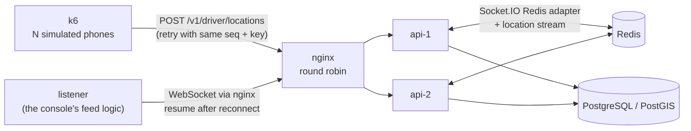

# Scale test

The question: with two API instances behind a load balancer, does every driver position reach a
dispatcher console, and how late, even when one instance dies mid-run?

## What runs



1. `docker compose --profile stack` starts PostgreSQL/PostGIS, Redis, two API instances, the
   worker and nginx.
2. `dispatch-sim seed` enrols N drivers through the API, as a dispatcher would.
3. The listener (`dispatch-sim listen`) connects through nginx like the web console: WebSocket
   only, reconnecting with backoff, resuming from the newest stream id it saw (with a 5-second
   overlap) and dropping repeats. It uses the same `LiveFeed` code as the console.
4. k6 (`load/drivers.ts`, `grafana/k6:2.3.0`) runs one virtual user per driver. Each records a fix
   every few seconds and sends its queue; failed requests are resent with the same sequence
   numbers and idempotency keys, as the driver app does.
5. Halfway through, `docker kill --signal KILL dispatch-api-1`. Consoles on that instance lose
   their connection; requests in flight on it fail and are resent (nginx forwards failed
   location batches to the other instance, and k6 retries).
6. `dispatch-sim verify` compares the database, where every acknowledged fix is stored, with the
   fixes the listener received. **A fix that is stored but was never received is a lost event.**

Latency is measured from the `sentAt` timestamp k6 puts on each batch to the moment the listener
receives the fix. Both run as containers on the same Docker host, so they share a clock.

## Run it

```bash
load/run-scale-test.sh --drivers 50 --duration 120      # functional run, about 4 minutes
load/run-scale-test.sh --drivers 1000 --duration 600    # the full run, on a quiet machine
node load/report.mjs load/results/<run> --docs [--publish-timings]
```

The script builds the images, runs the test, prints a summary, exits non-zero if any event was
lost, and stops the stack (keep it with `--keep-stack`). Raw results stay in `load/results/<run>/`
(not committed: the fleet file holds device tokens).

## Results

Every row below comes from `load/run-scale-test.sh` followed by `node load/report.mjs --docs`. Runs
on a development machine shared with other workloads are functional checks only: they count lost
events, and their latencies are not published because other containers on the same machine
distort them. The latency columns are filled by a run on a quiet machine with
`--publish-timings`.

<!-- results:start -->

| Run              | Drivers | Duration | Fix interval | Instance killed          | Fixes stored | Fixes received | Lost | Resumes | p95 latency, all fixes      | p95 latency, live fixes     | Environment                                                            |
| ---------------- | ------- | -------- | ------------ | ------------------------ | ------------ | -------------- | ---- | ------- | --------------------------- | --------------------------- | ---------------------------------------------------------------------- |
| 20260925T234728Z | 50      | 120 s    | 3 s          | api-1 (SIGKILL, mid-run) | 1861         | 1861           | 0    | 1       | pending (quiet-machine run) | pending (quiet-machine run) | MINGW64_NT-10.0-26200, Docker 29.8.0, 16 CPUs, 7.4 GiB; commit 475f9ae |
| 20260926T013333Z | 20      | 60 s     | 3 s          | api-1 (SIGKILL, mid-run) | 379          | 379            | 0    | 1       | pending (quiet-machine run) | pending (quiet-machine run) | MINGW64_NT-10.0-26200, Docker 29.8.0, 16 CPUs, 7.4 GiB; commit 2a1408b |

<!-- results:end -->

## Reading the numbers

- **Lost** must be 0. Fixes are stored before they are acknowledged and published to the Redis
  stream before the response; a console that loses its connection asks for everything after the
  newest stream id it saw.
- **p95, all fixes** includes fixes recovered by a resume, whose delay includes the reconnect.
  **p95, live fixes** covers fixes that arrived over an open connection.
- The stream keeps 15 minutes (`LOCATION_STREAM_RETENTION_MIN`). A console away for longer
  receives `gap: true` and reloads the driver list instead.
